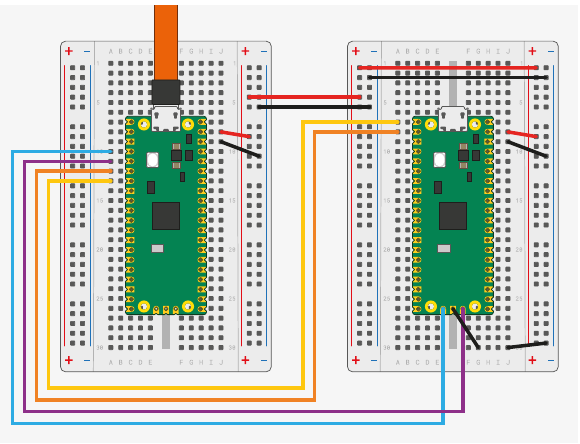
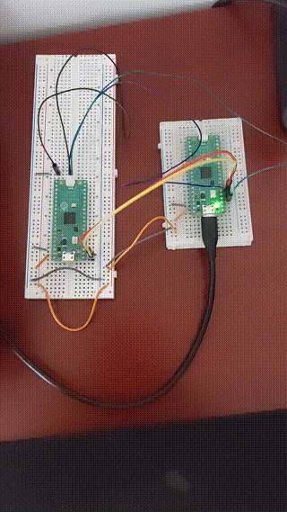
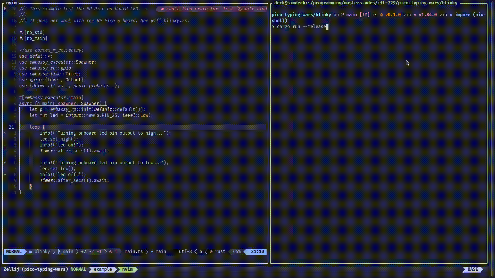

# Project: Pico Button Wars

Projet de session pour le cours _IFT-769 - Systèmes Temps Réel_.

Avec la plateforme Raspberry Pi Pico, nous allons implémenter un jeu de rapidité de réponse (et possiblement de frappe)
avec des composants électroniques (bouton, LED, écran LCD, clavier USB).

Le projet est divisé en 2 parties:

1. **Partie 1**: Implémentation primaire d'un jeu de rapidité de temps de réaction avec bouton et LED
2. **Partie 2 (optionnel)**: Implémentation d'un jeu de rapidité de frappe sur un clavier USB avec affichage sur écran LCD

**TLDR:** Voir la [démonstration pour la partie 1 ici](#démo-moviecamera)

## Table des matières

<!--toc:start-->
- [Project: Pico Button Wars](#project-pico-button-wars)
  - [Table des matières](#table-des-matières)
  - [Introduction :book:](#introduction-book)
    - [Vue d'ensemble](#vue-densemble)
      - [Partie 1](#partie-1)
      - [Partie 2 (TODO)](#partie-2-todo)
    - [Le choix de Rust](#le-choix-de-rust)
  - [Écheancier et livraisons :calendar:](#écheancier-et-livraisons-calendar)
    - [Objectifs personnels](#objectifs-personnels)
  - [Environnement de développement :hammer_and_wrench:](#environnement-de-développement-hammerandwrench)
    - [Chaîne d'outils Rust standards](#chaîne-doutils-rust-standards)
    - [Ressources, librairies et outils pour le développement Rust sur systèmes embarqués](#ressources-librairies-et-outils-pour-le-développement-rust-sur-systèmes-embarqués)
    - [Débuggage avec `probe-rs` et système de build avec `cargo`](#débuggage-avec-probe-rs-et-système-de-build-avec-cargo)
      - [Debugging avec un 2e Raspberry Pi Pico](#debugging-avec-un-2e-raspberry-pi-pico)
      - [Système de build](#système-de-build)
      - [Projet `blinky`](#projet-blinky)
  - [Instruction pour l'environnement de développement](#instruction-pour-lenvironnement-de-développement)
    - [Installation de Rust](#installation-de-rust)
    - [Choix de la chaine d'outils](#choix-de-la-chaine-doutils)
    - [Compilation et/ou exécution du projet `blinky`](#compilation-etou-exécution-du-projet-blinky)
    - [Compilation et/ou exécution du projet `pico-button-wars`](#compilation-etou-exécution-du-projet-pico-button-wars)
  - [Mise en place du matériel :rocket:](#mise-en-place-du-matériel-rocket)
    - [Matériel requis](#matériel-requis)
  - [Pico Button Wars :video_game:](#pico-button-wars-videogame)
    - [Structure du code](#structure-du-code)
      - [Vue d'ensemble](#vue-densemble)
      - [`common.rs`](#commonrs)
      - [`game.rs`](#gamers)
      - [`led.rs`](#ledrs)
      - [`button.rs`](#buttonrs)
        - [Debounce test](#debounce-test)
        - [Tâche asynchrone pour monitorer les boutons (_reset_)](#tâche-asynchrone-pour-monitorer-les-boutons-reset)
      - [`main.rs`](#mainrs)
        - [Initialisation et lancement de tâches asynchrones](#initialisation-et-lancement-de-tâches-asynchrones)
        - [Boucle principale du jeu](#boucle-principale-du-jeu)
  - [Démo :movie_camera:](#démo-moviecamera)
    - [Exemple d'une partie](#exemple-dune-partie)
    - [Reset avec les 2 boutons](#reset-avec-les-2-boutons)
  - [Conclusion :checkered_flag:](#conclusion-checkeredflag)
  - [References :books:](#references-books)
<!--toc:end-->

## Introduction :book:

### Vue d'ensemble

Le projet consiste à créer un jeu de rapidité de réponse et de frappe en utilisant la plateforme Raspberry Pi Pico. Le jeu est divisé en deux parties:

1. **Partie 1**: Implémentation primaire d'un jeu de rapidité de temps de réaction avec bouton et LED
2. **Partie 2 (TODO)**: Implémentation d'un jeu de rapidité de frappe sur un clavier USB avec affichage sur écran LCD

**TLDR:** Voir la [démonstration pour la partie 1 ici](#démo-moviecamera)

#### Partie 1

Le jeu est conçu pour tester la rapidité de réaction et de frappe des joueurs. La partie 1 consiste globalement
à appuyer sur un bouton dès que la LED s'allume après un délai aléatoire suite au déclenchement du jeu. Il y aura
2 boutons et 2 LEDs pour permettre à 2 joueurs de jouer simultanément. Ainsi, la boucle de jeu consiste à:

1. Attendre un délai aléatoire
2. Allumer les 2 LEDs
3. Attendre que les joueurs appuient sur leur bouton respectif
4. Mesurer le temps de réaction et déclarer le gagnant
5. Faire clignoter la LED du gagnant
6. Répéter le jeu.

#### Partie 2 (TODO)

La partie 2 est une extension de la partie 1, où le jeu teste la rapidité de frappe des joueurs. Le jeu consiste à prendre
le gagnant de la partie 1 et le faire jouer à un jeu de rapidité de frappe. Le joueur doit répéter une séquence de caractères
affichée sur un écran LCD. Ces séquences seront des lignes de code aléatoires (Possiblement le code source ?).
Le joueur doit taper la séquence le plus rapidement possible dans un temps limité (en fonction du nombre de caractères).

### Le choix de Rust

<span style="color:orange">Rust</span> [0] est un langage de programmation moderne qui met l'accent sur la <span style="color:orange">sécurité mémoire, la rapidité et la concurrence</span>. Il prend en charge plusieurs paradigmes de programmation et peut être utilisé à diverses fins (par exemple, programmation système, développement backend/serveur, outils CLI, etc.).

Rust est également connu pour ses systèmes de propriété et de durées de vie, ainsi que son vérificateur de types strict, qui garantit la sécurité mémoire sans nécessiter de ramasse-miettes, grâce au mécanisme de vérification des emprunts du compilateur.
De plus, c'est un langage de plus en plus populaire autant en industrie qu'en académie [2].

Puisque le cours est axé sur les systèmes temps réel, Rust est un choix judicieux pour ce projet en raison de sa performance, de sa sécurité mémoire
et des contraintres de temps reél et des ressources limitées de la plateforme Raspberry Pi Pico.

## Écheancier et livraisons :calendar:

- [x] _L00_: Introduction et planification :calendar:
- [ ] _L01_: Progrès avec démonstration d'une partie du projet (partie 1 souhaitée!) :video_game:
- [ ] _L02_: Présentation avec démonstration :rocket: du projet final et rapport

| Livrable | Date limite | Description                                                                                                                                                                   |
| -------- | ----------- | ----------------------------------------------------------------------------------------------------------------------------------------------------------------------------- |
| L00      | 2025-01-27  | Introduction et planification. GitHub repo, documentation, matériels requis etc.                                                                                              |
| L01      | 2025-03-10  | Progrès avec démonstration d'une partie du projet. Exécution de la partie 1 souhaitée, sinon en voie de finalisation. Code source, documentation, vidéo de démonstration etc. |
| L02      | 2025-04-07  | Présentation finale du projet avec démonstration. Code source, documentation, vidéo de démonstration terminée avec Rapport final.                                             |

### Objectifs personnels

- Initiations à la programmation de systèmes embarqués, à la plateforme Raspberry Pi Pico et à la programmation en Rust.
- Initiations à l'utilisation de périphériques électroniques, protocoles de communications (I2C, SPI, USB).
- Développement de compétences en programmation temps réel, gestion de ressources et contraintes de temps.

## Environnement de développement :hammer_and_wrench:

Après avoir essayé d'utiliser à-priori le SDK C/C++ du Raspberry Pi Pico, j'ai décidé de me tourner vers Rust pour ce projet.
Quoique C soit le langage de prédilection pour les systèmes embarqués, mon impression initiale de la chaine d'outils
avec _CMake_ via le SDK Pico, le débuggage semi-fonctionnelle via un 2e pico avec _OpenOCD_ et _GDB_ ainsi qu'aucune gestion
native par le SDK pour le _multi-threading_ m'ont poussé à explorer une alternative.

J'ai également eu un problème avec l'initialisation des périphériques via le
SDK Pico, où l'exemple `blinky` ne fonctionnait pas. En utilisant le 2e pico débuggeur,
j'ai pu voir que le code s'exécutait, mais blockait dans le code d'initialisation dans la boucle suivante:

```c
while (!time_reached(t_before)) {
    uint32_t save = spin_lock_blocking(sleep_notifier.spin_lock);
    lock_internal_spin_unlock_with_wait(&sleep_notifier, save);
}
```

Une trace de cette démarche reste sur la branche `c-version-sdk`.
J'ai donc décidé de me tourner vers Rust pour ce projet.

Après avoir brièvement exploré l'introduction à Rust via **The Rust Programming Language** [1], j'ai décidé d'opter qui semblait
être un choix judicieux pour ce projet (ainsi que pour l'apprentissage personnel). La chaîne d'outils de Rust est bien intégrée
avec le développement de systèmes embarqués.

### Chaîne d'outils Rust standards

La chaine d'outils de Rust contient qui est géré via `rustup` contient:

- `rustc`: Compilateur Rust
- `cargo`: Gestion de package et build system
- `rustup`: Gestionnaire de version et chaines d'outils
- `rls`: Rust Language Server pour l'intégration avec les éditeurs de texte
- `rustfmt`: Formatter pour Rust
- `clippy`: Linter pour Rust
- `rust-analyzer`: Analyseur de code pour Rust (Interface avec les éditeurs)

### Ressources, librairies et outils pour le développement Rust sur systèmes embarqués

Premièrement, une première ressource clée est le livre **The Embedded Rust Book** [2] qui est une ressource complète pour le développement Rust sur systèmes embarqués.
De plus, il existe un [Rust Embedded Working Group](https://github.com/rust-embedded) qui fournit des outils, des
librairies et des ressources pour le développement Rust sur systèmes embarqués.

Ensuite, il existe plusieurs librairies et outils pour le développement Rust sur systèmes embarqués:

- `svd2rust`: Générateur de code Rust à partir de fichiers SVD (System View Description) pour les périphériques ARM. [Exécutable svd2rust](https://docs.rs/svd2rust/latest/svd2rust/)
- `probe-rs`: Outil de programmation et de débuggage pour les microcontrôleurs ARM Cortex-M. [Site Web Officiel](https://probe.rs/)
- `cortex-m`: Librairie pour le développement ARM Cortex-M en Rust. Inclus routines d'interruptions, gestion erreurs etc. [GitHub](https://github.com/rust-embedded/cortex-m)
- `embedded-hal`: Abstraction des périphériques pour les systèmes embarqués. [GitHub](https://github.com/rust-embedded/embedded-hal)
- `rp2040-pac`: Périphériques ARM Cortex-M0+ pour le Raspberry Pi Pico. [GitHub](https://github.com/rp-rs/rp2040-pac)
- `rp-rs/rp-hal`: HAL pour le Raspberry Pi Pico. [GitHub](https://github.com/rp-rs/rp-hal)
- `embassy-rs`: Framework asynchrone pour les systèmes embarqués. [Site Web Officiel](https://embassy.dev/) [5]

### Débuggage avec `probe-rs` et système de build avec `cargo`

#### Debugging avec un 2e Raspberry Pi Pico

Tel que retrouvé dans la documentation du [Raspberry Pi Pico](https://datasheets.raspberrypi.com/pico/getting-started-with-pico.pdf),
il est possible d'utiliser un 2e pico comme débuggeur pour le pico principale.
On peut voir le schéma de connexion ici où le pico débuggeur est connecté à l'ordinateur
et le pico principale est connecté au pico débuggeur via les pins `SWD` ici:



Ainsi, ça nous permet à la fois de simplifier le chargement des exécutables sur le pico principale et également de
débugger le code en utilisant `probe-rs` et `gdb`.

#### Système de build

Dans le contexte des systèmes embarqués, le projet `blinky` est un projet de démonstration qui consiste à faire clignoter une LED.
C'est l'équivalent du `hello world!` pour les systèmes embarqués.
Ainsi, je me suis inspiré de l'exemple du projet `blinky` avec `embassy-rs` pour mettre en place l'environnement de développement.

Ce framework nous permettra de gérer les périphériques et les interruptions de manière asynchrone sans avoir recours
à un RTOS (Real-Time Operating System). En minimisant les dépendances, un système de build avec `cargo` et `probe-rs`, nous avons un bon point de départ avec [blinky qui se trouve dans se répertoire](./blinky/).

Voici les éléments nécessaires pour établir un système de build avec `cargo` et un Pi Pico:

**`build.rs`**:

- Facilite l'intégration de la carte des addresses mémoires pour le pico
  avec le fichier `memory.x`. Est utilisé par les crates en lien avec les accès aux périphériques (_PAC_) et
  les abstraction du matériels (_HAL_).
- Passer des flags de compilation pour le linker et le compilateur. i.e. `--nmagic` permet de désactiver l'alignement des pages car nous n'utilisons pas un tel système de pagination de la mémoire dans un système embarqué comme le Pico.

**`memory.x`**:

- Fichier de configuration de la mémoire pour le linker. Définit les sections de mémoire pour le bootloader,
  la mémoire flash et la RAM du pico.

**`Cargo.toml`**:

- Fichier de configuration de `cargo` pour le projet. Contient les dépendances, les configurations de build pour la compilation.
- Contient également les informations de notre projet (nom, version, auteur etc.)

Les profiles `release` et `dev` sont configurés ici, c'est à dire que lorsque nous compilons notre projet avec
`cargo build --release`, les options de compilation pour la version de production sont utilisées. Dans notre cas,
nous avons les options suivantes:

```toml
# Configuration de build pour la version de production
[profile.release]
debug = 2  # Niveau de debuggage complet
lto = true  # Link Time Optimization actif, donc optimisation du code à la compilation
opt-level = 'z'  # Niveau d'optimisation pour la taille du binaire à minimiser
```

**`rust-toolchain.toml`**:

- Fichier de configuration pour `rustup` qui permet de spécifier la chaine d'outils (version et composantes) de Rust.

**`.cargo/config.toml`**:

- Fichier de configuration pour `cargo` qui permet de spécifier les options de build pour le projet.
- Dans notre cas, on spécifie `probe-rs` comme le `runner` pour le débuggage et la cible `thumbv6m-none-eabi` pour la compilation.

`thumbv6m-none-eabi` est la cible pour les microcontrôleurs ARM Cortex-M0 et M0+ (le processeur du Pico).

**`main.rs`**:

- Fichier source principal du projet.
- L'attribut `#![no_std]` indique que nous n'utilisons pas la librairie standard de Rust.
- L'attribut `#![no_main]` indique que nous n'utilisons pas la fonction `main` de Rust,
  mais plutot la fonction `embassy_executor::main` qui est fournie par le framework `embassy-rs`.

Il y aura plus de détails sur le fonctionnement de `embassy-rs` avec `async/await` plus loin.

#### Projet `blinky`

Le projet `blinky` est un projet de démonstration qui consiste à faire clignoter une LED sur le Raspberry Pi Pico.
En utilisant le framework `embassy-rs`, ceci nous permet de facilement faire clignoter une LED en prenant avantager
des fonctionnalités asynchrones (surtout pour le timer).

On voit la LED sur le pico (correspondant à la pin 25) clignoter à une fréquence de 1Hz:


Sur la console:



## Instruction pour l'environnement de développement

### Installation de Rust

  Avec rustup.sh, on installe le gestionnaire de version de Rust `rustup` qui permet de gérer les versions de Rust et les chaines d'outils.

```bash
curl --proto '=https' --tlsv1.2 -sSf https://sh.rustup.rs | sh
```

Ou également avec le package manager de ta distribution:

```bash
# Ubuntu/debian
sudo apt install rustup

# Fedora
sudo dnf install rustup
rustup-init
```

On peux verifier l'installation avec:

```bash
rustup --version
rustc --version
```

On a besoin de `probe-rs` pour le débuggage et la programmation du pico. On l'installe avec `cargo` ou avec un package manager:

```bash
# avec cargo (de la source)
cargo install probe-rs

# Script d'installation pour Linux
curl --proto '=https' --tlsv1.2 -LsSf https://github.com/probe-rs/probe-rs/releases/latest/download/probe-rs-tools-installer.sh | sh

probe-rs --version
```

### Choix de la chaine d'outils

Pour faciliter l'installation de la chaine d'outils pour le développement sur le Pi Pico, on peut d'abord cloner le dépôt:

```bash
git clone git@github.com:simlal/pico-button-wars.git
cd pico-button-wars
```

Pour développer avec Rust sur le Raspberry Pi Pico, on a besoin de la chaine d'outils rust `nightly-2024-12-10` pour compiler pour la cible `thumbv6m-none-eabi`.

En étant dans le répertoire du projet, la chaine d'outils devrait être détectée automatiquement par `rustup`.

Ceci est spécifié dans le fichier `rust-toolchain.toml`:

```toml
[toolchain]
channel = "nightly-2024-12-10"
targets = [
    "thumbv6m-none-eabi",
]
```

On peut ajouter ainsi les composantes comme le `rust-analyzer` et `rustfmt` pour notre IDE:

```bash
rustup component add rust-analyzer
rustup component add rustfmt
```

### Compilation et/ou exécution du projet `blinky`

Pour rouler le projet `blinky`, on peut utiliser `cargo` pour compiler et exécuter le projet:

```bash
cd blinky
# Pour build seulement 
cargo build --release
```

Le mode _release_ est utiliser ici par habitude car on utilise le _flag_ d'optimisation 'z' pour minimiser la taille du binaire. Voici le profil de compilation dans le fichier `Cargo.toml`:

```toml
[profile.release]
debug = 2
lto = true
opt-level = 'z'
```

On a est en mode debug quand même avec `debug = 2` pour avoir des informations de debuggage et la variable d'environnement pour notre mode de log:

```toml
[env]
DEFMT_LOG = "debug"
```

En ayant le pico débuggeur connecté, on peut directement compiler et exécuter `blinky`:

```bash
cargo run --release

# On devrait voir le flash et les message de log INFO 
Finished `release` profile [optimized + debuginfo] target(s) in 0.16s
     Running `probe-rs run --chip RP2040 target/thumbv6m-none-eabi/release/blinky`
      Erasing ✔ 100% [####################]  12.00 KiB @  52.45 KiB/s (took 0s)
  Programming ✔ 100% [####################]  12.00 KiB @  41.28 KiB/s (took 0s)                                                            Finished in 0.53s
0.000350 INFO  Turning onboard led pin output to high...
└─ blinky::____embassy_main_task::{async_fn#0} @ src/main.rs:22
0.000379 INFO  led on!
└─ blinky::____embassy_main_task::{async_fn#0} @ src/main.rs:24
1.000426 INFO  Turning onboard led pin output to low...
└─ blinky::____embassy_main_task::{async_fn#0} @ src/main.rs:27
1.000446 INFO  led off!
...
```

### Compilation et/ou exécution du projet `pico-button-wars`

Même principe pour le projet `pico-button-wars`:

```bash
cd pico-button-wars
cargo build --release
```

## Mise en place du matériel :rocket:

Tel que vu dans le schéma de connexion pour le débuggage, nous avons besoin de connecter le pico débuggeur à l'ordinateur.
Ainsi, le pico principal est facilement connecté au pico débuggeur via les pins `SWD` pour flasher le code et débugger le code.

En plus de la mise en place de base, pour notre projet, nous aurons besoin de connecter les composants suivants:

- 2 LEDs (rouge et verte)
- 2 boutons de couleurs différentes
- Écran LCD
- Clavier USB (Optionnel)
- Adapteurs USB, _breadboard_, fils de connexion etc.

Nous utilisons des couleurs différentes pour les LEDs et les boutons pour distinguer les joueurs.

### Matériel requis

Pour la partie 1, nous avons besoin des composants suivants:

| Composante(s) | Quantité | Description | Prix |
| ------------- | -------- | ---------- | ---- |
| Raspberry Pi Pico-H | 2 | Microcontrôleur ARM Cortex-M0+ avec headers pré-installés | 7$ chacun |
| Breadboards | 2 | Breadboards de 400 points | 5$ chacun |
| Fils de connection Jumper | TODO | Pour connecter les composants | < 3$ |
| LEDs | 2 | Rouge et verte | < 3$ |
| Resistances | ??? | LEDs=1kOhm, Boutons=10kOhm, ??? | < 3$ |

Pour la partie 2, nous ajoutons un clavier USB pour tester la rapidité de frappe des joueurs et un adapteur.

| Composante(s) | Quantité | Description | Prix |
| ------------- | -------- | ---------- | ---- |
| Écran LCD | 1 | 3.2 Inch 320x240 Touch LCD | 20$ |
| Clavier USB | 1 | Clavier USB | ~10$ |
| Adapteur OTG | 1 | Conversion USB-A vers micro USB | ~10$ |

## Pico Button Wars :video_game:

Le projet consiste à créer un jeu de rapidité de réponse et de bouton sur un Raspberry Pi Pico.
(Je n'ai pas eu le temps de faire la partie 2 donc voici la partie 1 seulement.)

### Structure du code

#### Vue d'ensemble

Le code est divisé en plusieurs modules pour faciliter la lecture et la compréhension du code. Les différents modules sont:

- `common.rs`: Module contenant des fonctions utilitaires du projet (i.e. Rng, trait formattage console etc.)
- `game.rs`: Module contenant la logique du jeu. Contient l'objet principal de jeu pour faire les transitions
  entre les états du jeu.
- `led.rs`: Module contenant la logique pour contrôler les LEDs. Contient les fonctions pour allumer et éteindre les LEDs.
- `button.rs`: Module contenant la logique pour contrôler les boutons. Contient les fonctions pour lire l'état des boutons, gérer le débounce etc.
- `main.rs`: Fichier source principal du projet. Contient l'initialisation des périphériques et la boucle principale du jeu.

**A NOTER**:

#### `common.rs`

Possiblement un mauvaix choix de nom de module (aurait pu contenir les types génériques, traits communs etc.), mais contient principalement le Rng simpliste:

```rust
pub struct SimpleRngU64 {
    seed: u64,
}
impl SimpleRngU64 {
    pub fn new() -> Self {
        // Use the current time as initial seed
        let now = Instant::now();
        let seed = now.as_micros();
        Self { seed }
    }

    // Seed update
    pub fn next_u64(&mut self) -> u64 {
        const A: u64 = 1664525;
        const C: u64 = 1013904223;
        self.seed = self.seed.wrapping_mul(A).wrapping_add(C);
        self.seed
    }

    // Linear congruential generator implementation
    pub fn generate_from_range(&mut self, from: u64, to: u64) -> u64 {
        if from >= to {
            return from;
        }
        from + (self.next_u64() % (to - from + 1))
    }
}
```

Utile pour avoir un temps de lumière aléatoire pour la LED avant l'éteindre et donc rendre le jeu moins prévisible.

#### `game.rs`

Le module `game.rs` contient la logique du jeu. Il contient les différentes étapes du jeu et les transitions entre les états du jeu.
On l'utilise comme un singleton statique pour gérer l'état du jeu. Il contient également les fonctions pour gérer les transitions entre les états du jeu.

```rust

type GameMutex = Mutex<CriticalSectionRawMutex, Option<Game>>;
static GAME: GameMutex = Mutex::new(None);

#[derive(PartialEq, Eq, Format, Clone, Copy)]
pub enum GameState {
    Waiting,
    Playing,
    ComputingResults,
    Finished,
}

// Singleton game instance
#[derive(Format)]
struct Game {
    state: GameState,
    state_start: Instant,
    state_duration: Duration,
}

// Avec les méthodes de gestion de transitions
fn update_state_duration(&mut self) {...} 
fn transition(&mut self, next_state: GameState) {...}
...
// On accede le singleton avec GAME.lock()
// Exemple acces au gamestate et reset avec le watchdog
pub async fn get_current_game_state_or_reset(
    wd: &'static Mutex<ThreadModeRawMutex, Option<Watchdog>>,
) -> GameState {
    let game_lock = GAME.lock().await;
    match game_lock.as_ref() {
        Some(game) => game.state,
        None => {
            async {
                warn!(
                    "Attempted to get game state but GAME singleton not initialized. Resetting..."
                );
                // Lock the watchdog to prevent feeding
                let _lock_forever = wd.lock().await;
                loop {
                    Timer::after_secs(10).await; // Keep the lock forever
                }
            }
            .await;
            // HACK: Should not be reached, but fallback
            GameState::Waiting
        }
    }
}
```

#### `led.rs`

Le module `led.rs` contient la logique pour contrôler les LEDs. Il contient les fonctions pour allumer et éteindre les LEDs,
autant pour les routines de bases que des abstractions pour réfléter l'état du jeu

```rust
 
#[derive(PartialEq, Eq, Format, Clone, Copy)]
pub enum LedRole {
    Onboard,
    Player1,
    Player2,
}

// A simple abstraction over an output pin with a role
pub struct Led<'a> {
    output: Output<'a>,
    role: LedRole,
}
impl Led<'_> {
    pub fn new<P: Pin>(pin: P, role: LedRole) -> Self {
        Self {
            output: Output::new(pin, Level::Low), // Initialize Output with the pin
            role,
        }
    }

    pub fn turn_on(&mut self) {
        self.output.set_high();
    }

    pub fn turn_off(&mut self) {
        self.output.set_low();
    }

  // autres ...

}

// Exemple utilise pour la routine publique allumage + eteignage du jeu:

pub async fn round_playing_leds_routine_on_off(
    leds: &'_ mut [Led<'_>; 3],
    current_round: usize,
) -> Instant {
    // Signal that round 'i' is about to start then quick blinky
    info!("Players get ready for round {}", current_round);
    for _ in 0..current_round + 1 {
        for led in leds.iter_mut() {
            led.turn_on();
        }
        Timer::after_millis(750).await;
        for led in leds.iter_mut() {
            led.turn_off();
        }
        Timer::after_millis(750).await;
    }
    Timer::after_millis(500).await;
    for _ in 0..4 {
        for led in leds.iter_mut() {
            led.turn_on();
        }
        Timer::after_millis(150).await;
        for led in leds.iter_mut() {
            led.turn_off();
        }
        Timer::after_millis(150).await;
    }

    // Generate random time in ms between 2000-5000 ms for led signal to press button
    let mut rng = SimpleRngU64::new();
    let leds_duration = rng.generate_from_range(2000, 5000);
    info!(
        "Rng time for LED ON until shutoff for current game round: {} ms. ",
        leds_duration
    );
    for led in leds.iter_mut() {
        led.turn_on();
    }
    Timer::after_millis(leds_duration).await;

    for led in leds.iter_mut() {
        led.turn_off();
    }
    info!("GO!");
    Instant::now()
}
```

#### `button.rs`

Le module `button.rs` contient la logique pour contrôler les boutons. Il contient les fonctions pour lire l'état des boutons,
avoir une tache pour le 'reset' du jeu (via le jeune du watchdog), evaluer la valeur de 'debounce', attendre et mesure des actions de pressage des boutons.

C'est donc un module qui est important et doit être bien testé pour éviter les faux positifs et les faux négatifs, s'assurer que rien n'est bloqué lors de l'exécution pour l'exécution propre du jeu.

La structure générale du module est la suivante:

```rust
// Debounce time with prior tests from measure_minimal_debounce()
const MINIMAL_DEBOUNCE_TIME: u64 = 50;

#[derive(PartialEq, Eq, Format, Clone, Copy, Debug, Hash)]
pub enum ButtonRole {
    Player1,
    Player2,
}

pub struct Button<'a> {
    input: Input<'a>,
    role: ButtonRole,
    debounce: Duration,
}
```

Et les methodes pour autant attendre un appui sur le bouton, que le debounce ou simplement monitorer son état:

```rust

impl Button<'_> {
    pub fn new<P: Pin>(pin: P, role: ButtonRole) -> Self {
        Self {
            input: Input::new(pin, Pull::Up), // Initialize input with pull up
            role,
            debounce: Duration::from_millis(MINIMAL_DEBOUNCE_TIME),
        }
    }

    pub fn role(&self) -> ButtonRole {
        self.role
    }

    async fn wait_for_press(&mut self) -> Instant {
        loop {
            self.input.wait_for_falling_edge().await;
            let press_instant = Instant::now();
            Timer::after(self.debounce).await;
            // safety in case debounce not enough
            if self.input.get_level() == Level::Low {
                info!("{} button pressed.", self.role);
                return press_instant;
            }
        }
    }

    async fn wait_for_release(&mut self) -> Instant {
        loop {
            self.input.wait_for_low().await;
            let release_instant = Instant::now();
            Timer::after(self.debounce).await;
            // safety in case debounce not enough
            if self.input.get_level() == Level::High {
                info!("{} button released.", self.role);
                return release_instant;
            }
        }
    }

    pub async fn measure_full_press_release(&mut self) -> Instant {
        self.wait_for_press().await;
        return self.wait_for_release().await;
    }

  // Autres methodes...
}
```

##### Debounce test

J'ai tout d'abord effectuer des tests pour mesurer notre _worst case debounce time_ pour le bouton, mais tout en évaluant si le comportent du bouton était acceptable.

En utilisant cette routine de test, on evalue le temps de debounce minimal pour le bouton. On peut l'utiliser pour ajuster la valeur de debounce dans le code du jeu apres comme variable `const` lors de la construction d'une instance de `Button`:

```rust

pub async fn measure_minimal_debounce(&mut self, ms_test_range: u64, iterations: usize) -> u64 {
    const MIN_DEBOUNCE_DEFAULT_IN_TEST: u64 = 50;
    info!(
        "Measuring debounce for {} Button with {} ms max and averaging over {}",
        self.role, ms_test_range, iterations
    );
    let mut total_transitions = 0;
    let mut max_debounce_time = 0;
    for i in 0..iterations {
        // Wait for an initial press
        self.input.wait_for_low().await;
        info!("Button pressed! Measuring minimal debounce time");

        // Debounce
        let mut transitions = 0;
        let mut last_level = Level::Low; // We just checked its low

        let start_time = Instant::now();
        let mut last_transition_time = start_time;
        let mut longest_debounce = Duration::from_millis(0);
        // Fix: Add duration to start_time instead of subtracting
        let end_time = start_time + Duration::from_millis(ms_test_range);

        // Evaluate max transition time
        while Instant::now() < end_time {
            let current_level = self.input.get_level();
            if current_level != last_level {
                transitions += 1;
                let now = Instant::now();

                // No need to debounce if no transitions
                if transitions > 1 {
                    let bounce_duration = now - last_transition_time;
                    if bounce_duration > longest_debounce {
                        longest_debounce = bounce_duration;
                        debug!("New longest debounce: {} ms", bounce_duration.as_millis());
                    }
                }

                last_transition_time = now;
                debug!(
                    "Transition #{} detected from {} to {} at {} ms from test start.",
                    transitions,
                    self.level_to_str(&last_level),
                    self.level_to_str(&current_level),
                    (last_transition_time - start_time).as_millis()
                );
                last_level = current_level;
            }

            // Small delay to prevent tight CPU looping
            Timer::after_micros(50).await;
        }

        info!(
            "Detected {} transitions in iteration {}",
            transitions,
            i + 1
        );
        if transitions > 0 {
            info!(
                "Longest debounce interval: {}ms",
                longest_debounce.as_millis()
            );
            max_debounce_time = max_debounce_time.max(longest_debounce.as_millis());
        }

        total_transitions += transitions;

        info!(
            "Found {} transitions with longest_debounce time of {} ms for test iteration i={}",
            transitions,
            longest_debounce.as_millis(),
            i
        );

        // Wait for button release before next iteration
        if i < iterations - 1 {
            self.input.wait_for_high().await;
            // Add delay between tests
            Timer::after_millis(500).await;
        }
    }
    // Compute summary
    let avg_transitions = if iterations > 0 {
        total_transitions / iterations as u64
    } else {
        0
    };
    info!(
        "Summary: Avg transitions={}, longest_debounce_time={} ms over {} iterations.",
        avg_transitions, max_debounce_time, iterations
    );
    info!(
        "Returning 10% over maximum debounce time or default {}",
        MIN_DEBOUNCE_DEFAULT_IN_TEST
    );
    (max_debounce_time + (max_debounce_time / 10)).max(MIN_DEBOUNCE_DEFAULT_IN_TEST)
}

```

Ainsi, en appelant la fonction sur chacun des boutons, plusieurs fois avec au moins 10 itérations, on peut évaluer le temps de debounce minimal pour le bouton. On peut ensuite l'utiliser pour ajuster la valeur de debounce dans le code du jeu apres comme variable `const` lors de la construction d'une instance de `Button`.

J'ai donc évaluer que dans le pire cas en général, une valeur de 50 ms serait adéquate (la majorité des tests étaient bas de )s 50ms, mais il y avait quelques cas de ~100ms, donc j'ai décidé de prendre la valeur de 50ms pour le debounce.

##### Tâche asynchrone pour monitorer les boutons (_reset_)

Puisque nous voulons _spawn_ une tache asynchrone pour les boutons avec _Embassy_, nous avons besoin d'avoir une reference statique pour chacun des boutons (donc _lifetime_ du programme en entier). Ainsi, lorsque n'importe quelle ressource veut acceder à un bouton, il doit le faire via un _Mutex_.

```rust

// Could be subject to interrupt but OK for now
pub type ButtonMutex = Mutex<ThreadModeRawMutex, Option<Button<'static>>>;

// Dans le main.rs on a une initilisation ou on fait crash s'il y a un pepin!
static BUTTON_P1: ButtonMutex = Mutex::new(None);
static BUTTON_P2: ButtonMutex = Mutex::new(None);
{
  let mut button_p1_unlocked = BUTTON_P1.lock().await;
  *button_p1_unlocked = Some(Button::new(p.PIN_10, ButtonRole::Player1));

  let mut button_p2_unlocked = BUTTON_P2.lock().await;
  *button_p2_unlocked = Some(Button::new(p.PIN_11, ButtonRole::Player2));

  // Making sure we panic if unproperly init
  match *button_p1_unlocked {
      None => crate::panic!("Could not initialize player 1 button."),
      Some(_) => info!("Initialized 'BUTTON_P1'  as static shareable thread-safe ref",),
  }
  match *button_p2_unlocked {
      None => crate::panic!("Could not initialize player 2 button."),
      Some(_) => info!("Initialized 'BUTTON_P2'  as static shareable thread-safe ref",),
  }
}
```

**Tache pour monitorer un appui simultané sur les 2 boutons afin de déclencher un reset via le _Watchdog_:**

Ici, nous avons une tache asynchrone qui monitor les 2 boutons et qui déclenche un reset si les 2 boutons sont pressés en même temps pendant plus de 3 secondes.
On essai de ne pas bloquer le mutex trop longtemps pour éviter de bloquer le jeu. On utilise un `select` pour monitorer chacun des boutons en même temps, qui permet de voir lequel des _futures_ est terminé en premier (et sinon lâcher le mutex rapidement en sortant de la portée).

En évaluant les changements d'états et en mettant à jour les temps de pressions, on peut monitorer si les 2 boutons sont pressés en même temps pendant plus de 3 secondes. Si oui, on déclenche un reset via le _Watchdog_.

```rust

#[embassy_executor::task(pool_size = 1)]
pub async fn monitor_double_longpress(
    b1: &'static ButtonMutex,
    b2: &'static ButtonMutex,
    wd: &'static Mutex<ThreadModeRawMutex, Option<Watchdog>>,
) {
    // Less-blocking approach with 50 ms polling on button mutex
    let mut ticker = Ticker::every(Duration::from_millis(50));

    // Track long press state
    let mut b1_pressed_time: Option<Instant> = None;
    let mut b2_pressed_time: Option<Instant> = None;
    let mut reset_countdown_active = false;

    loop {
        // Check both buttons without holding locks for too long
        let b1_pressed = {
            // Only try to lock for a short 10ms time before giving up
            match select(b1.lock(), Timer::after(Duration::from_millis(10))).await {
                Either::First(button_lock) => {
                    if let Some(button) = button_lock.as_ref() {
                        button.input.get_level() == Level::Low
                    } else {
                        false // Could not acquire lock
                    }
                }
                Either::Second(_) => {
                    // Couldn't get lock, maintain previous state
                    b1_pressed_time.is_some()
                }
            }
        };

        let b2_pressed = {
            // Only try to lock for a short time before giving up
            match select(b2.lock(), Timer::after(Duration::from_millis(10))).await {
                Either::First(button_lock) => {
                    if let Some(button) = button_lock.as_ref() {
                        button.input.get_level() == Level::Low
                    } else {
                        false // Could not acquire lock
                    }
                }
                Either::Second(_) => {
                    // Couldn't get lock, maintain previous state
                    b2_pressed_time.is_some()
                }
            }
        };

        // Update press times
        if b1_pressed && b1_pressed_time.is_none() {
            b1_pressed_time = Some(Instant::now());
            debug!("Button 1 pressed");
        }

        if b2_pressed && b2_pressed_time.is_none() {
            b2_pressed_time = Some(Instant::now());
            debug!("Button 2 pressed");
        }

        // Check for button releases
        if !b1_pressed && b1_pressed_time.is_some() {
            let duration = b1_pressed_time.unwrap().elapsed();
            debug!("Button 1 released after {} ms", duration.as_millis());
            b1_pressed_time = None;
            reset_countdown_active = false;
        }

        if !b2_pressed && b2_pressed_time.is_some() {
            let duration = b2_pressed_time.unwrap().elapsed();
            debug!("Button 2 released after {} ms", duration.as_millis());
            b2_pressed_time = None;
            reset_countdown_active = false;
        }

        // Check for longpress condition
        if let (Some(t1), Some(t2)) = (b1_pressed_time, b2_pressed_time) {
            let b1_duration = t1.elapsed();
            let b2_duration = t2.elapsed();

            if !reset_countdown_active
                && b1_duration.as_millis() >= 1000
                && b2_duration.as_millis() >= 1000
            {
                reset_countdown_active = true;
                info!(
                    "Both buttons held for 1+ second. Continuing to monitor for reset threshold..."
                );
            }

            // Check if press duration is enough to trigger reset
            if b1_duration.as_millis() >= 3000 && b2_duration.as_millis() >= 3000 {
                info!(
                    "Long press detected on both buttons (b1={} ms, b2={} ms). Resetting via watchdog...",
                    b1_duration.as_millis(),
                    b2_duration.as_millis()
                );

                // Lock the watchdog to prevent feeding
                let _lock_forever = wd.lock().await;
                loop {
                    Timer::after_secs(10).await; // Keep the lock forever
                }
            }
        }

        ticker.next().await;
    }
}
```

#### `main.rs`

La logique principale du projet est dans le fichier `main.rs`. Il contient l'initialisation des périphériques, la boucle principale du jeu et les tâches asynchrones.

En utilisant l'exécuteur `embassy`, on peut facilement créer des tâches asynchrones pour gérer les boutons et le watchdog, utiliser les timers et des attentes de réponses à des _futures_. Cet API est compatible avec les HAL et PAC de `rp-rs` et `embedded-hal`, les librairies pour les conteneurs sur la pile `heapless` et autres ressources en programmation embarquées.

Le main est décoré du feature flag `#[embassy_executor::main]` qui permet de spécifier la fonction principale du programme. Il est important de noter que nous n'utilisons pas la fonction `main` de Rust, mais plutôt la fonction `embassy_executor::main` qui est fournie par le framework `embassy-rs`.

Nous avons donc accès au spawner de l'exécuteur `embassy` pour créer des tâches asynchrones.

```rust

#[embassy_executor::main]
async fn main(spawner: Spawner) {...}
```

##### Initialisation et lancement de tâches asynchrones

Nous devons donc premièrement initialiser les périphériques du pico. Nous avons besoin de:

- 3 LEDS: (onboard, player1, player2)
- 2 boutons: (player1, player2)

Et nos instances globales:

- 1 watchdog: (pour le reset du jeu)
- 1 Game: (la logique du jeu)

Finalement nos conteneurs pour les règles et scores (sur la pile évidemment):

```rust
const TOTAL_ROUNDS: usize = 5;
const WIN_THRESHOLD: usize = TOTAL_ROUNDS.div_ceil(2);
let mut round_winner_times: [(Option<ButtonRole>, u64); TOTAL_ROUNDS] =
    [(None::<ButtonRole>, u64::MIN); TOTAL_ROUNDS];

let mut players_scores = FnvIndexMap::<ButtonRole, usize, 2>::new();
players_scores.insert(ButtonRole::Player1, 0).unwrap();
players_scores.insert(ButtonRole::Player2, 0).unwrap();
```

Ceci est exécuté avant la boucle de jeu principale. On fait paniquer le programme si l'initialisation échoue.

Nous pouvons ainsi lancer notre watchdog nourris a toutes les 500 ms avec un temps de jeune de 3s, ce qui laisse le temps de faire un reset si les 2 boutons sont pressés en même temps pendant plus de 3 secondes, reset au cas ou il serait bloqué ailleurs:

```rust
#[embassy_executor::task(pool_size = 1)]
pub async fn feed_watchdog(
    wd: &'static Mutex<ThreadModeRawMutex, Option<Watchdog>>,
    feed_schedule: Duration,
) {
    let mut ticker = Ticker::every(feed_schedule);
    loop {
        {
            let mut wd_unlocked = wd.lock().await;
            if let Some(wd) = wd_unlocked.as_mut() {
                wd.feed();
                // info!("watchdog fed")
            }
        } // watchdog lock dropped here
        ticker.next().await;
    }
}
```

Tel que mentionné plus haut, nous avons aussi une tâche asynchrone pour monitorer les boutons et faire un reset si les 2 boutons sont pressés en même temps pendant plus de 3 secondes qui ira bloqué l'accès au watchdog et va naturellement le starve donc declencher un reset.

##### Boucle principale du jeu

Nous avons donc 4 états principaux selon le `GameState` enum:

- `Waiting`: En attente de l'appui sur le bouton pour commencer le jeu
- `Playing`: En train de jouer
- `ComputingResults`: En train de calculer les résultats
- `Finished`: Le jeu est terminé. On recommence

**Mode _Waiting_**:

La première étape est d'évaluer l'état du GameState à chaque début de la boucle de jeu et d'effectuer la transition vers le prochain état en fonction du `match`

```rust
GameState::Waiting => {
  info!("We are waiting! Resetting scores before next game");
  // Resetting scores in case we are coming in from a previous game
  for (role, time) in round_winner_times.iter_mut() {
    *role = None;
    *time = 0;
  }

  if let Entry::Occupied(mut o) = players_scores.entry(ButtonRole::Player1) {
    *o.get_mut() = 0;
  }
  if let Entry::Occupied(mut o) = players_scores.entry(ButtonRole::Player2) {
    *o.get_mut() = 0;
  }
  // Wait for single press on each
  loop {
    waiting_state_leds(&mut leds).await;

    info!("Press any button within the next 2 seconds to start the game...");
    let mut b1_unlocked = BUTTON_P1.lock().await;
    let mut b2_unlocked = BUTTON_P2.lock().await;
    if let (Some(b1_ref), Some(b2_ref)) =
    (b1_unlocked.as_mut(), b2_unlocked.as_mut())
    {
      match select3(
        b1_ref.wait_for_full_press(),
        b2_ref.wait_for_full_press(),
        Timer::after_secs(2),
      )
      .await
      {
        Either3::First(_) => {
          info!("Player 1 button pressed, we can start the game!");
          break;
        }
        Either3::Second(_) => {
          info!("Player 2 button pressed, we can start the game!");
          break;
        }
        Either3::Third(_) => {
          info!("Timeout! going through routine again.")
        }
      }
    }
  }
  transition_game_state(GameState::Playing).await;
}
```

Le mode Waiting (Attente) prépare le jeu pour une nouvelle partie et attend le déclenchement du début de jeu. Ce mode:

- Réinitialise complètement les scores et les temps des joueurs précédents
- Remet à zéro les compteurs pour les deux joueurs
- Active un motif lumineux distinctif sur les LEDs indiquant l'état d'attente
- Entre dans une séquence d'invitation où:
  - Un message invite les joueurs à appuyer sur un bouton dans les 2 secondes
  - Le système surveille simultanément trois événements possibles:
    - Pression complète du bouton du joueur 1
    - Pression complète du bouton du joueur 2
    - Expiration du délai de 2 secondes
  - Si un joueur appuie sur son bouton, le jeu peut commencer et passe au mode Playing
  - Si aucun bouton n'est pressé dans le délai imparti, la séquence d'invitation recommence

Cette phase d'attente garantit que le jeu démarre dans des conditions équitables avec une réinitialisation complète des scores, tout en offrant une interface utilisateur intuitive pour lancer une nouvelle partie.

**Mode _Playing_**:

Le mode Playing (Jeu) est le cœur du jeu où les joueurs s'affrontent. Ce mode:

1. Indique que le jeu est en cours et prépare les joueurs pour le premier tour.
2. Pour chaque tour, il exécute une séquence de préparation:
   - Les LEDs clignotent pour signaler le début du tour.
   - Un temps aléatoire est généré pour allumer la LED.
   - Les joueurs doivent appuyer sur leur bouton dès que la LED s'éteint.
3. Le système surveille les deux boutons pour déterminer lequel des joueurs a réagi le plus rapidement.
4. Le gagnant du tour est déterminé en fonction du temps de réaction et est enregistré.
5. Les scores des joueurs sont mis à jour et affichés.
6. Si on a un gagnant (meilleur de 5, mais modifiable dans le code), le jeu passe à l'état _ComputingResults_.

On laisse le temps de 2 secondes entre chaque tour pour permettre aux joueurs de se préparer et d'appeler le reset au besoin.

On bloque le mutex des boutons pour éviter de d'interférer avec le jeu, mais on s'assure de le libérer rapidement après chaque tour.

```rust
GameState::Playing => {
  info!("We are playing!");
  'rounds: for (i, round) in round_winner_times.iter_mut().enumerate() {
    info!("Players get ready for round #{}", i);

    // Insure we have both button mutex
    let mut b1_unlocked = BUTTON_P1.lock().await;
    let mut b2_unlocked = BUTTON_P2.lock().await;
    if let (Some(b1_ref), Some(b2_ref)) =
    (b1_unlocked.as_mut(), b2_unlocked.as_mut())
    {
      // Randomized time w/ light ON then OFF + pick first to full press w/ time
      let target_time_press =
      round_playing_leds_routine_on_off(&mut leds, i).await;
      let winner_timepress = select(
        b1_ref.measure_full_press_release(),
        b2_ref.measure_full_press_release(),
      )
      .await;

      // Use the button to match the winner led and add it to scores container
      let winner = match winner_timepress {
        Either::First(p1_release) => {
          info!("B1 was faster!");
          let p1_score = (p1_release - target_time_press).as_millis();
          (b1_ref.role(), p1_score)
        }
        Either::Second(p2_release) => {
          info!("B2 was faster!");
          let p2_score = (p2_release - target_time_press).as_millis();
          (b2_ref.role(), p2_score)
        }
      };
      // Update the player scores
      if let Entry::Occupied(mut o) = players_scores.entry(winner.0) {
        *o.get_mut() += 1;
      }

      // Save score and highlight round winner
      highlight_round_winner(
        &mut leds,
        winner.0,
        *players_scores.get(&winner.0).unwrap(),
      )
      .await;
      *round = (Some(winner.0), winner.1);
      info!(
        "DINGINGINGING! Congratulations for {} with a response time of {} ms",
        winner.0, winner.1
      );
      // If we have a winner (best of 5), transition to Computing Results
      info!("Current scores: ");
      for (player, score) in &players_scores {
        info!("{}: {}", player, score);
        if *score == WIN_THRESHOLD {
          transition_game_state(GameState::ComputingResults).await;
          break 'rounds;
        }
      }
    }
    info!(
    "Target window for ressetting game with long button double press of 2s..."
  );
    drop(b1_unlocked);
    drop(b2_unlocked);
    Timer::after_secs(2).await; // Just before starting next round
  }
}
```

**Mode _ComputingResults_**:

On calcule les résultats du jeu et on affiche le gagnant. On utilise les temps de réponse des joueurs pour déterminer le meilleur joueur et on affiche les statistiques de la partie. La routine de flashage des LEDs est utilisée pour mettre en valeur le gagnant.

```rust
GameState::ComputingResults => {
  info!("Computing results for current game...");
  let highest_scorer = players_scores
    .iter()
    .max_by_key(|&(_, score)| score)
    .map(|(player, _)| *player)
    .unwrap();

  let mut best_response_time = u64::MAX;
  let mut worst_response_time = u64::MIN;
  let mut avg_response_time: u64 = 0;

  for (role, time) in &round_winner_times {
    if let Some(r) = role {
      if *r == highest_scorer {
        // Compute stats for winner
        avg_response_time += *time;
        if *time < best_response_time {
          best_response_time = *time;
        }
        if *time > worst_response_time {
          worst_response_time = *time;
        }
      }
    }
  }
  avg_response_time /= WIN_THRESHOLD as u64;

  // Log stats and celebrate winner
  info!("Winner {} had an avg response time of {} ms (best time {} ms, worst time {} ms",
    highest_scorer,
    avg_response_time,
    best_response_time,
    worst_response_time
  );
  Timer::after_secs(1).await; // Let us read before transition!
  highlight_game_winner(&mut leds, highest_scorer).await;
  game::transition_game_state(GameState::Finished).await;
}

```

**Mode _Finished_**:

Un simple reset vers le mode Attente.

```rust
GameState::Finished => {
  info!("Finished the game. Going back into waiting mode.");
  game::transition_game_state(GameState::Waiting).await;
}
```

## Démo :movie_camera:

### Exemple d'une partie

[Vidéo de démonstration](https://youtube.com/shorts/mJzi2ivcp6k?feature=share)

Et les logs correspondant:

```text
pico-button-wars/pico-button-wars on  main is 󰏗 v0.1.0 via 󱘗 v1.85.0-nightly took 5s
❯ cargo run --release
    Finished `release` profile [optimized + debuginfo] target(s) in 0.14s
     Running `probe-rs run --chip RP2040 --log-format '{t} - {f} [{L:<4}]  {s}
' target/thumbv6m-none-eabi/release/pico-button-wars`
      Erasing ✔ 100% [####################]  24.00 KiB @  61.93 KiB/s (took 0s)
  Programming ✔ 100% [####################]  24.00 KiB @  44.36 KiB/s (took 1s)                                                                                                    Finished in 0.94s
0.000597 - main.rs [INFO]  Raspberry Pi Pico init in main executor...

0.000314 - main.rs [INFO]  Initialized 'WATCHDOG'  as static shareable thread-safe ref

0.000338 - main.rs [INFO]  Started watchdog on feed scheduale of 3 s

0.000409 - main.rs [INFO]  Initializing Led { role: Onboard, output_level=Low }...

0.000471 - main.rs [INFO]  Initializing Led { role: Player1, output_level=Low }...

0.000513 - main.rs [INFO]  Initializing Led { role: Player2, output_level=Low }...

0.000583 - main.rs [INFO]  Initialized 'BUTTON_P1'  as static shareable thread-safe ref

0.000600 - main.rs [INFO]  Initialized 'BUTTON_P2'  as static shareable thread-safe ref

0.000631 - game.rs [INFO]  GAME mutex init.

0.000655 - main.rs [INFO]  OK for Game Singleton.

################ WAITING ################

0.000682 - game.rs [DEBUG]  Current GameState=Waiting, started=0 ms from boot with current-duration=0 ms

0.000819 - main.rs [INFO]  We are waiting! Resetting scores before next game

6.126485 - main.rs [INFO]  Press any button within the next 2 seconds to start the game...

8.126529 - main.rs [INFO]  Timeout! going through routine again.

12.600970 - button.rs [DEBUG]  Button 1 pressed

12.750974 - button.rs [DEBUG]  Button 1 released after 150 ms

14.252103 - main.rs [INFO]  Press any button within the next 2 seconds to start the game...

14.532480 - button.rs [INFO]  Player1 button pressed.

14.532510 - main.rs [INFO]  Player 1 button pressed, we can start the game!

14.532548 - game.rs [DEBUG]  Current GameState=Waiting, started=0 ms from boot with current-duration=14531 ms

14.532606 - game.rs [INFO]  Current state duration before transition=Waiting->Playing: 14531 ms

################ PLAYING ################

14.532656 - game.rs [INFO]  Transition finished: Game { state: Playing, state_start: Instant { ticks: 14532650 }, state_duration: Duration { ticks: 14531919 } }

14.532727 - main.rs [INFO]  We are playing!

14.532752 - main.rs [INFO]  Players get ready for round #0

14.532793 - led.rs [INFO]  Players get ready for round 0

17.732975 - led.rs [INFO]  Rng time for LED ON until shutoff for current game round: 4042 ms.

21.775029 - led.rs [INFO]  GO!

22.254500 - button.rs [INFO]  Player1 button pressed.

22.304557 - button.rs [INFO]  Player1 button released.

22.304586 - main.rs [INFO]  B1 was faster!

23.704803 - led.rs [DEBUG]  Blinking winner Led { role: Player1, output_level=Low } for current_score: 1

24.704890 - main.rs [INFO]  DINGINGINGING! Congratulations for Player1 with a response time of 479 ms

24.704929 - main.rs [INFO]  Current scores:

24.704955 - main.rs [INFO]  Player1: 1

24.704991 - main.rs [INFO]  Player2: 0

24.705023 - main.rs [INFO]  Target window for ressetting game with long button double press of 2s...

26.705060 - main.rs [INFO]  Players get ready for round #1

26.705089 - led.rs [INFO]  Players get ready for round 1

31.405226 - led.rs [INFO]  Rng time for LED ON until shutoff for current game round: 2871 ms.

34.276266 - led.rs [INFO]  GO!

34.825871 - button.rs [INFO]  Player2 button pressed.

34.875916 - button.rs [INFO]  Player2 button released.

34.875943 - main.rs [INFO]  B2 was faster!

36.276117 - led.rs [DEBUG]  Blinking winner Led { role: Player2, output_level=Low } for current_score: 1

37.276189 - main.rs [INFO]  DINGINGINGING! Congratulations for Player2 with a response time of 549 ms

37.276227 - main.rs [INFO]  Current scores:

37.276248 - main.rs [INFO]  Player1: 1

37.276281 - main.rs [INFO]  Player2: 1

37.276313 - main.rs [INFO]  Target window for ressetting game with long button double press of 2s...

39.276343 - main.rs [INFO]  Players get ready for round #2

39.276372 - led.rs [INFO]  Players get ready for round 2

45.476515 - led.rs [INFO]  Rng time for LED ON until shutoff for current game round: 4675 ms.

50.151552 - led.rs [INFO]  GO!

50.549276 - button.rs [INFO]  Player1 button pressed.

50.649336 - button.rs [INFO]  Player1 button released.

50.649361 - main.rs [INFO]  B1 was faster!

52.049532 - led.rs [DEBUG]  Blinking winner Led { role: Player1, output_level=Low } for current_score: 2

54.049618 - main.rs [INFO]  DINGINGINGING! Congratulations for Player1 with a response time of 447 ms

54.049655 - main.rs [INFO]  Current scores:

54.049675 - main.rs [INFO]  Player1: 2

54.049706 - main.rs [INFO]  Player2: 1

54.049739 - main.rs [INFO]  Target window for ressetting game with long button double press of 2s...

56.049769 - main.rs [INFO]  Players get ready for round #3

56.049798 - led.rs [INFO]  Players get ready for round 3

63.749952 - led.rs [INFO]  Rng time for LED ON until shutoff for current game round: 4295 ms.

68.044989 - led.rs [INFO]  GO!

68.612813 - button.rs [INFO]  Player1 button pressed.

68.712872 - button.rs [INFO]  Player1 button released.

68.712896 - main.rs [INFO]  B1 was faster!

70.113065 - led.rs [DEBUG]  Blinking winner Led { role: Player1, output_level=Low } for current_score: 3

73.113164 - main.rs [INFO]  DINGINGINGING! Congratulations for Player1 with a response time of 617 ms

73.113200 - main.rs [INFO]  Current scores:

73.113220 - main.rs [INFO]  Player1: 3

73.113260 - game.rs [DEBUG]  Current GameState=Playing, started=14532 ms from boot with current-duration=58580 ms

73.113314 - game.rs [INFO]  Current state duration before transition=Playing->ComputingResults: 58580 ms

73.113361 - game.rs [INFO]  Transition finished: Game { state: ComputingResults, state_start: Instant { ticks: 73113357 }, state_duration: Duration { ticks: 58580607 } }

################ COMPUTING RESULTS ################

73.113429 - main.rs [INFO]  Computing results for current game...

73.113481 - main.rs [INFO]  Winner Player1 had an avg response time of 514 ms (best time 447 ms, worst time 617 ms

82.114188 - game.rs [DEBUG]  Current GameState=ComputingResults, started=73113 ms from boot with current-duration=9000 ms

82.114247 - game.rs [INFO]  Current state duration before transition=ComputingResults->Finished: 9000 ms

82.114293 - game.rs [INFO]  Transition finished: Game { state: Finished, state_start: Instant { ticks: 82114290 }, state_duration: Duration { ticks: 9000824 } }

################ FINISH + RESET TO WAIT ################

82.114354 - main.rs [INFO]  Finished the game. Going back into waiting mode.

82.114377 - game.rs [DEBUG]  Current GameState=Finished, started=82114 ms from boot with current-duration=0 ms

82.114428 - game.rs [INFO]  Current state duration before transition=Finished->Waiting: 0 ms

82.114468 - game.rs [INFO]  Transition finished: Game { state: Waiting, state_start: Instant { ticks: 82114464 }, state_duration: Duration { ticks: 84 } }

82.114522 - main.rs [INFO]  We are waiting! Resetting scores before next game

88.240100 - main.rs [INFO]  Press any button within the next 2 seconds to start the game...

90.240133 - main.rs [INFO]  Timeout! going through routine again.

96.365704 - main.rs [INFO]  Press any button within the next 2 seconds to start the game...
```

### Reset avec les 2 boutons

[Démo de reset avec les 2 boutons](https://youtube.com/shorts/U9RWrXn6WUA?feature=share)

On perds le lien avec `probe-rs` car reset hardware:

```text
7.056322 - game.rs [INFO]  Transition finished: Game { state: Playing, state_start: Instant { ticks: 7056317 }, state_duration: Duration { ticks: 7055562 } }

7.056392 - main.rs [INFO]  We are playing!

7.056417 - main.rs [INFO]  Players get ready for round #0

7.056457 - led.rs [INFO]  Players get ready for round 0

10.256638 - led.rs [INFO]  Rng time for LED ON until shutoff for current game round: 3161 ms.

13.417690 - led.rs [INFO]  GO!

13.825521 - button.rs [INFO]  Player1 button pressed.

13.925594 - button.rs [INFO]  Player1 button released.

13.925621 - main.rs [INFO]  B1 was faster!

15.325841 - led.rs [DEBUG]  Blinking winner Led { role: Player1, output_level=Low } for current_score: 1

16.325924 - main.rs [INFO]  DINGINGINGING! Congratulations for Player1 with a response time of 457 ms

16.325961 - main.rs [INFO]  Current scores:

16.325985 - main.rs [INFO]  Player1: 1

16.326019 - main.rs [INFO]  Player2: 0

16.326050 - main.rs [INFO]  Target window for ressetting game with long button double press of 2s...

17.550975 - button.rs [DEBUG]  Button 1 pressed

17.600975 - button.rs [DEBUG]  Button 2 pressed

18.326083 - main.rs [INFO]  Players get ready for round #1

18.326112 - led.rs [INFO]  Players get ready for round 1

18.620985 - button.rs [INFO]  Both buttons held for 1+ second. Continuing to monitor for reset threshold...

20.620987 - button.rs [INFO]  Long press detected on both buttons (b1=3070 ms, b2=3020 ms). Resetting via watchdog...

23.026244 - led.rs [INFO]  Rng time for LED ON until shutoff for current game round: 2476 ms.

 WARN probe_rs::session: Could not clear all hardware breakpoints: An ARM specific error occurred.

Caused by:
    0: An error occurred in the communication with an access port or debug port.
    1: Target device did not respond to request.
 WARN probe_rs::session: Failed to deconfigure device during shutdown: Arm(Dap(NoAcknowledge))
 WARN probe_rs::architecture::arm::communication_interface: Failed to stop DP Multidrop(11002927)
Error: An ARM specific error occurred.

Caused by:
    0: Error using access port FullyQualifiedApAddress { dp: Multidrop(16787751), ap: V1(0) }.
    1: Failed to read register DRW at address 0xd0c
    2: An error occurred in the communication with an access port or debug port.
    3: Target device did not respond to request.
```

## Conclusion :checkered_flag:

Sommes toutes, le projet est un bon exemple de l'utilisation de Rust pour la programmation embarquée. Il utilise les concepts de base de Rust, tels que les traits, les énumérations et les structures, la gestion des erreurs et valeurs null (`Option` et `Result` enums) pour créer un jeu simple mais amusant. Le projet utilise également des concepts avancés tels que les tâches asynchrones et les mutex pour gérer la concurrence et la synchronisation entre les différentes parties du code.

J'aurais pu créer des abstractions plus sophistiquées pour gérer les boutons et les LEDs, notamment en utilisant un système d'interruptions et en implémentant une priorisation entre les tâches avec une gestion plus fine des mutex. Cependant, j'ai privilégié la simplicité et la lisibilité du code pour ce projet. Les constantes utilisées pour les temps de debounce et les délais d'attente pourraient également être rendues configurables dans une version future, offrant ainsi plus de flexibilité sans sacrifier la robustesse du système.

## References :books:

<!-- As numbered footnotes-->

<a id="0">[0]</a> **Rust Programming Language**. Rust Foundation. 2024. <https://www.rust-lang.org/>
<a id="1">[1]</a> **The Rust Programming Language**. Klabnik, Steve, and Carol Nichols. 2nd ed., No Starch Press.
<a id="2">[2]</a> **Industry and academia support**. Rust For Linux. 2024. <https://rust-for-linux.com/industry-and-academia-support>
<a id="3">[3]</a> **The Embedded Rust Book**. Rust Embedded Working Group. 2024. <https://docs.rust-embedded.org/book/>
<a id="4">[4]</a> **Rust Embedded**. Rust Embedded Working Group. 2024. <https://rust-embedded.github.io/book/>
<a id="5">[5]</a> **Embassy**. Embassy. 2024. <https://embassy.dev/>
