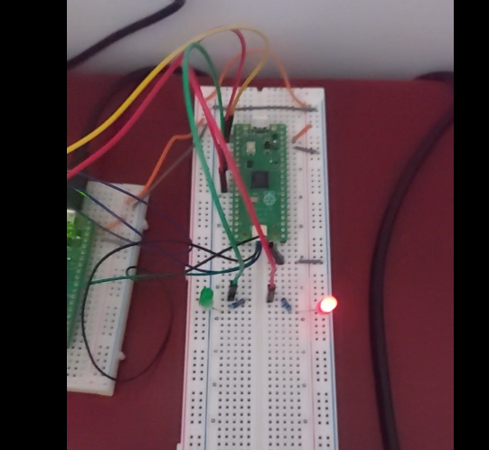

# Rapport L01

Le but du livrable L01 est de faire un rapport sur l'avancement du projet. J'y décrit de façon succincte les tâches réalisées, les problèmes rencontrés et les solutions apportées. J'y présente également les résultats obtenus et les perspectives pour la suite du projet.

## Progrès du projet et problèmes rencontrés

### Pivot du SDK Pico C/C++ vers Rust (framework _Embassy_ + crates)

Quoique C/C++ soit le(s) langage(s) de prédilection pour les systèmes embarqués, mon impression initiale de la chaine d'outils
avec _CMake_ via le SDK Pico, le débuggage semi-fonctionnelle via un 2e pico avec _OpenOCD_ et _GDB_ ainsi qu'aucune gestion
native par le SDK pour le _multi-threading_ m'ont poussé à explorer une alternative.

J'ai également eu un problème avec l'initialisation des périphériques via le
SDK Pico, où l'exemple `blinky` ne fonctionnait pas. En utilisant le 2e pico débuggeur,
j'ai pu voir que le code s'exécutait, mais blockait dans le code d'initialisation dans la boucle suivante:

```c
while (!time_reached(t_before)) {
    uint32_t save = spin_lock_blocking(sleep_notifier.spin_lock);
    lock_internal_spin_unlock_with_wait(&sleep_notifier, save);
}
```

J'ai donc décidé de pivoter vers Rust en utilisant le framework _Embassy_ et les _crates_ (packages disponibles en Rust) afin de pouvoir tirer possible des avantages d'un gestionnaire de tâches pour le _multi-threading_ tout en gardant l'efficacité de la programmation bas-niveau.

### _blinky_ et routine de patrons d'allumage des LEDs

#### Blinky

J'ai tout d'abord commencé par faire le `hello_world` des systèmes embarqués, c'est-à-dire faire clignoter une LED.
.

Avec la communication série via _Serial Wire Debug_ (SWD), on peut voir les messages de log à la console:

```bash
cargo run --release

# On devrait voir le flash et les message de log INFO 
Finished `release` profile [optimized + debuginfo] target(s) in 0.16s
     Running `probe-rs run --chip RP2040 target/thumbv6m-none-eabi/release/blinky`
      Erasing ✔ 100% [####################]  12.00 KiB @  52.45 KiB/s (took 0s)
  Programming ✔ 100% [####################]  12.00 KiB @  41.28 KiB/s (took 0s)                                                            Finished in 0.53s
0.000350 INFO  Turning onboard led pin output to high...
└─ blinky::____embassy_main_task::{async_fn#0} @ src/main.rs:22
0.000379 INFO  led on!
└─ blinky::____embassy_main_task::{async_fn#0} @ src/main.rs:24
1.000426 INFO  Turning onboard led pin output to low...
└─ blinky::____embassy_main_task::{async_fn#0} @ src/main.rs:27
1.000446 INFO  led off!
...
```

Ça m'a permit de confirmer que mon environnement pour _flasher_ et débugger le Pico cible fonctionnait.

#### Routine de patrons d'allumage des LEDs

J'ai par la suite fait un montage simple avec 2 LEDs et les résistances appropriées. Cette première routine simple m'a permit de faire une structure modulaire du code pour le future du projet.

On retrouve dans le module `led.rs`, une abstraction pour interagir avec les périphériques de LEDs et de créer une première routine d'affichage:

```Rust
// A simple abstraction over an output pin with a role
pub struct Led<'a> {
    output: Output<'a>,
    role: &'a str,
}

impl Led<'_> {
    pub fn new<P: Pin>(pin: P, role: &'static str) -> Self {
        Self {
            output: Output::new(pin, Level::Low), // Initialize Output with the pin
            role,
        }
    }

    /// Blink the LED for a specified duration
    pub async fn flash_pattern(&mut self, blink_duration: Duration, repeats: usize) {
        for _ in 0..repeats {
            // Make sure we are off before flashing
            if self.output.is_set_high() {
                self.output.set_low();
            }
            self.output.set_high();
            Timer::after(blink_duration).await;
            self.output.set_low();
            Timer::after(blink_duration).await;
        }
    }

    pub fn role(&self) -> &str {
        self.role
    }
}
```

Dans l'environnement `no_std`, nous n'avons pas accès à un _heap_ et donc la création et modification dynamique de _string_ devient plus complexe. J'ai donc décidé de passer le rôle de la LED en tant que référence statique et donc suite de charactères connues à la compilation.

Afin de respecter le temps de vie des références pour les LEDs, dans notre _main_ on peut rendre le _borrow checker_ heureux en créant les LEDs dans un bloc:

```Rust
let onboard_led = Led::new(p.PIN_25, "onboard");
let player_1_led = Led::new(p.PIN_5, "player_1_led");
let player_2_led = Led::new(p.PIN_8, "player_2_led");
// Redondant on peut creer tt de suite le conteneur
let mut leds = [onboard_led, player_1_led, player_2_led];

waiting_state_leds(&mut leds).await;

// Dans notre module led.rs
pub async fn waiting_state_leds(leds: &mut [Led<'_>; 3]) {
    loop {
        // First pattern, fast flashes

        debug!("Flashing leds inside waiting_state_leds(): {}", leds);
        let mut duration = Duration::from_millis(200);
        for led in leds.iter_mut() {
            led.flash_pattern(duration, 2).await;
        }

        // Chasing second pattern
        let mut i: usize = 0;
        let mut passes: usize = 0;
        let max_circles: usize = 10;
        duration = Duration::from_millis(100);
        loop {
            leds[0].flash_pattern(duration, 1).await;
            leds[1].flash_pattern(duration, 1).await;
            leds[2].flash_pattern(duration, 1).await;

            // PERF: Need better pattern or algo
            i += 1;
            passes += 1;
            // Ramp up at each quarter
            if i > 2 {
                duration = duration.checked_sub(duration / 2).unwrap();
                i = 0;
            }

            if passes == max_circles {
                break;
            }
        }
        Timer::after_millis(500).await;
    }
}

```

Voici le montage du Pico principal:



On doit s'imaginer un pattern de clignotage joli dans ce rapport!

Pas très jolie car on est en train de bloquer le thread principal, mais c'est un début. On pourra le convertir en _task_ pour l'exécuteur _Embassy_ plus tard en fonction du GameState (voir plus bas).

### Séparation en modules et début de la gestion du `GameState`

En utilisant les modules, on peut facilement séparer les responsabilités et les tâches. Par exemple, le module `leds` s'occupe de l'initialisation des LEDs et de la routine de clignotement en fonction de l'état du jeu, de créer une encapsulation pour la gestion de l'état du jeu.

J'ai donc commencé à créer un module `game` pour gérer l'état du jeu. Pour l'instant, il n'y a qu'une structure `GameState` qui contient les informations de l'état du jeu. On utilise un singleton avec un `Mutex` pour garantir l'accès unique à l'état du jeu lors du changement d'état.

```Rust

#[derive(PartialEq, Eq, Format, Clone, Copy)]
pub enum GameState {
    Waiting,
    Playing,
    ComputingResult,
    Finished,
}

// Singleton game instance
#[derive(Format)]
struct Game {
    state: GameState,
    state_start: Instant,
    state_duration: Duration,
}
impl Game {
    // FIX: Make it default to waiting and initailize leds ?
    fn new(current_state: GameState) -> Game {
        Game {
            state: current_state,
            state_start: Instant::now(), // Makes sense when first creating the game
            state_duration: Duration::from_secs(0),
        }
    }
    // ... autres methodes
}

// Le singleton avec exemple pour changer l'état du jeu

// Game singleton with mutex to share accross tasks
pub static GAME: Mutex<CriticalSectionRawMutex, Option<Game>> = Mutex::new(None);

// Helper function to initialize the global game instance
pub async fn initialize_game() {
    let mut game_lock = GAME.lock().await;
    *game_lock = Some(Game::new(GameState::Waiting));
}

// Helper function to transition game state from any task
pub async fn transition_game_state(next_state: GameState) {
    let mut game_lock = GAME.lock().await;
    if let Some(game) = game_lock.as_mut() {  // Sucre syntaxique pour éviter de faire game_lock.as_ref().unwrap()
        game.transition(next_state);
    // releases game_lock
    } else {
        error!("GAME singleton not initialized properly!")
    }
}

```

### Test simpliste du chronomètre et de l'horloge

En effectuant quelques tests avec le module `Timer` de _Embassy_, en excluant le cout de l'affichage, on voit que le chronomètre fonctionne correctement pour nos besoins. J'ai utilisé une approche simple mais efficace en plaçant des points de contrôle avec `Timer::after_millis()` et en sauvegardant les valeurs dans des variables pour vérifier que l'affichage correspondait aux temps attendus. Bien que primitive, cette méthode de validation a confirmé que le timing était suffisamment précis pour les mécanismes de jeu comme le calcul de la vitesse de frappe et le décompte du temps restant.

## Pour la suite

### À court terme

À court terme, je vois les objectifs suivants:

- Finir la gestion de l'état du jeu et des transitions
- Intégrer la gestion des tâches asynchrones avec _Embassy_
- Développer la logique pour l'état de jeu `Playing` avec les boutons et les LEDs, ainsi que le calcul du gagnant.
- Créer un nouveau module `button.rs` pour la gestion des boutons.

Tel que mentionné plus haut, il faut que j'implémente une façon de gérer les tâches de façon asynchrone pour ne pas bloquer le thread principal. J'ai déjà commencé à regarder comment _Embassy_ fonctionne et comment je pourrais l'intégrer dans mon projet.

Également, je travaille sur une façon de déclencher les tâches en fonction des états de transitions du jeu. Ainsi, je pourrais éviter d'avoir une boucle infinie bloquante dans le _main_ et seulement travailler avec les interruptions et les événements.

Finalement, je dois travailler sur la logique du jeu pour le mode `Playing` et le calcul du gagnant. J'ai déjà une idée de comment je pourrais le faire, mais je dois d'abord m'assurer que la gestion des inputs des boutons soit correctement gérée et d'éviter les problèmes de _debouncing_.

### À plus long terme

Intégrer le display OLED pour afficher l'état du jeu et les messages de log. Je dois donc trouver un pilote qui utilise un protocole de communication compatible avec l'écran OLED que j'ai et ainsi pouvoir afficher les informations du jeu.

## Conclusion

Il me reste beaucoup de pain sur la planche, mais je pense pouvoir arriver à acommplir mon objectif principal du jeu de réaction avec les boutons, les LEDs et l'affichage OLED. J'espère pouvoir intégrer l'entrée au clavier, mais on verra bien!
